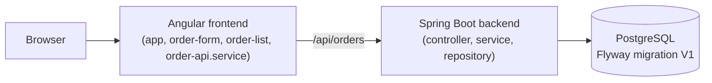

# Learning Map

How this repository was used to practice maintenance work on an existing codebase with Claude Code. The code is intentionally small so each change can be read end to end in a single PR.

## Baseline architecture

- One aggregate (`Order`), four endpoints, one screen, one migration.
- Backend layers are plain controller, service and repository. There are no generic base classes, no mapping framework and no Lombok.
- The frontend is a single page with three small components and one typed API service.
- Business rules (valid status transitions, validation) are enforced in the backend. The frontend only mirrors them to decide which buttons to show.
- It stayed small on purpose. A small surface makes each later change reviewable, and the diffs show the technique instead of the scale of the codebase.

## Maintenance exercises

### 1. Bug fix: whitespace-only customer name ([#2](https://github.com/Seldir193/claude-code-order-management/pull/2))

- **Problem:** the order form accepted `"   "` as a customer name because `Validators.required` treats a non-empty string as valid.
- **Workflow:** reproduce the bug as a failing spec in `app.spec.ts` (submit whitespace, expect no POST and the "Customer name is required." message), then make the smallest fix: add `Validators.pattern(/\S/)` in `order-form.ts`.
- **Result:** a 1-line fix plus one regression test. The backend was not touched, since `@NotBlank` already rejects blank names there.

### 2. Refactor: request-state cleanup with `finalize()` ([#4](https://github.com/Seldir193/claude-code-order-management/pull/4))

- **Problem:** `loading`, `busyOrderId` and `submitting` were reset by copies of the same line in both the `next` and `error` handlers, which is easy to miss when a handler changes.
- **Change:** each reset moved into one `pipe(finalize(...))` in `app.ts` (`load`, `onStatusChange`) and `order-form.ts` (submit).
- **Behavior preserved:** the existing specs were the safety net and were not edited. Success and error paths still clear state exactly once. No functional change was intended or made.

### 3. Feature: optional order-status filter ([#6](https://github.com/Seldir193/claude-code-order-management/pull/6))

- **Backend:** `GET /api/orders?status=NEW|PROCESSING|SHIPPED|CANCELLED`. The controller takes an optional `OrderStatus`, the service chooses between `findAll` and `findByStatus`, and both sort newest first. An unknown value returns 400 through Spring's enum conversion. Integration tests cover each filter value, the sort order, the empty result and the 400.
- **Frontend:** `order-api.service.ts` sends the `status` param. `order-list` adds a select (All, New, Processing, Shipped, Cancelled). `app.ts` holds the filter in a signal, reloads on change, and cancels the previous in-flight request.
- **Edge cases handled and tested:**
  - the filter survives a failed load and a retry;
  - a row leaves the list when a status change makes it no longer match the filter;
  - a newly created order is only prepended if it matches the filter.
- **README** API table updated in the same PR.

## Verification and CI

- Backend: `mvn -B verify` (JUnit, Mockito, MockMvc against H2 in PostgreSQL mode with the real Flyway migration). It can run in Docker without a local JDK; the commands are in the [README](../README.md#test-and-build).
- Frontend: `npm test -- --watch=false` (Vitest), then `npm run build`.
- GitHub Actions (`.github/workflows/ci.yml`) runs both jobs on pushes to `main` and on every pull request.
- Each exercise was a separate branch and PR with one focused change, so history reads as bug fix, then refactor, then feature.

## Skills demonstrated with Claude Code

| Skill | Where to see it |
| --- | --- |
| Codebase reading | Each change touches only the files that own the behavior, and reuses existing patterns such as `describeApiError` and the `OrderStatus` enum |
| Scoped change planning | #2 changes 1 line of source, #4 touches 2 files, #6 adds one query parameter without pagination or search |
| Test-first debugging | #2 pairs the fix with a regression spec that describes the user-visible failure |
| Behavior-preserving refactoring | #4 changes no specs and no UI behavior |
| Cross-stack feature implementation | #6 spans controller, service, repository, API client, signals and template, with tests on both sides |
| Verification | Backend and frontend suites plus the build, run locally and in CI |
| Git/PR discipline | One concern per PR, conventional commit titles, docs updated alongside behavior |

## Intentionally not built

To keep the project about maintenance rather than scale, none of these were added: authentication or users, payments, inventory, search, pagination, sorting options, messaging, microservices, Kubernetes, a generic repository or filter framework, a state-management library, or end-to-end browser tests. The status filter was kept to a single optional enum parameter for the same reason.
